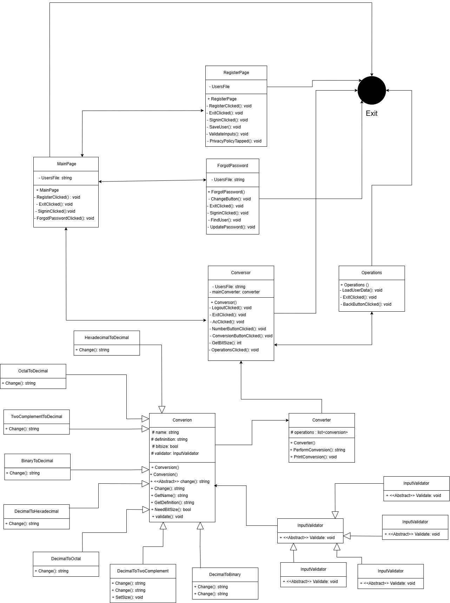

# Design Detailed Document 

## Table of Contents
1. [Introduction]
3. [Description]
3. [Problems]
4. [Conclusions]

---

## Introduction
- This document is a detailed design report for this conversion app, this app is a calculator based app that makes diferent type of decimal conversions.
---

## Description
- This conversor is a calculator like app that starts with a sign in page with an exit and register button, the register button goes to a registration page to create a new account all this information is saved in a csv file, there is also a forgot your password button in the sign in page where you write your username and if the user is correct it changes the password. The conversor page is connected to a program with all the conversion types, there is also a operations button that shows the information about the user and the number of operations that the user does. 

## Problems 
- Initial problems with the initialization of the components of a new page.
- Problems with the implementation of the csv file and the use of the sign in and register page

- Some problems with the decimal to two complement button
---

## Conclusions
-**Lessons Learned**
 - With this project i have learned how to use in a correct way a app using maui 
-**future projects**
- This project would help me to implement a new technology to create new programs.

